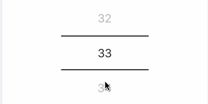

<h1 align="center">react-native-wheel-scrollview-picker</h1>
 
 <p align="center">
   
</p>
  
<p align="center">A pure js picker for React Native</h1>

<p align="center">  </p>

> - Original repository by @veizz: [react-native-picker-scrollview](https://github.com/veizz/react-native-picker-scrollview).
> - Fork by @yasemincidem who added the real cross platform behavior and datepicker [react-native-wheel-scroll-picker](https://github.com/yasemincidem/react-native-picker-scrollview).
> - This is the third fork of repository, since it seems that @yasemincidem is no longer supporting [react-native-wheel-scroll-picker](https://github.com/yasemincidem/react-native-picker-scrollview).

---

## Table of Contents
1. [Features](#features)
2. [Installation](#installation)
3. [Usage](#usage)
   - [Example](#usage)
4. [Props](#props)
5. [License](#license)

## Installation

```sh
yarn add react-native-wheel-scrollview-picker
# or
npm install react-native-wheel-scrollview-picker --save
```

## Usage

```jsx
import React, { Component } from 'react';
import ScrollPicker from 'react-native-wheel-scrollview-picker';

export default class SimpleExample extends Component {
  render() {
    return (
      <ScrollPicker
        dataSource={['1', '2', '3', '4', '5', '6']}
        selectedIndex={1}
        renderItem={(data, index) => {
          //
        }}
        onValueChange={(data, selectedIndex) => {
          //
        }}
        wrapperHeight={180}
        wrapperWidth={150}
        wrapperColor='#FFFFFF'
        itemHeight={60}
        highlightColor='#d8d8d8'
        highlightBorderWidth={2}
      />
    );
  }
}
```

## Props

| Props                |          Description          |  Type  |   Default |
| -------------------- | :---------------------------: | :----: | --------: |
| dataSource           |      Data of the picker       | Array  |           |
| selectedIndex        |  selected index of the item   | number |         1 |
| wrapperHeight        |     height of the picker      | number |           |
| wrapperWidth         |      width of the picker      | number |           |
| wrapperBackground    |       picker background       | string |    '#FFF' |
| itemHeight           |      height of each item      | number |           |
| highlightColor       |  color of the indicator line  | number | "#d8d8d8" |
| highlightBorderWidth |    width of the indicator     | string |         1 |
| activeItemTextStyle  | Active Item Text object style | object |           |
| itemTextStyle        |    Item Text object style     | object |           |

## Author

- [Richard Heng](http://richardheng.me/)

## License

MIT
